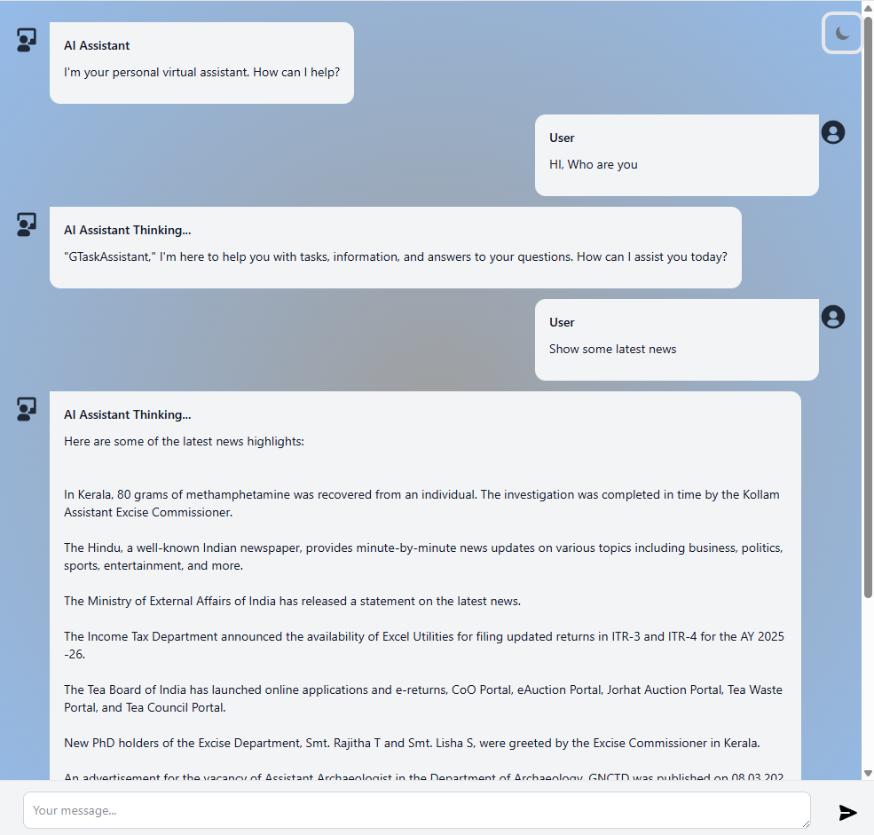

# GTaskAssistant

**GTaskAssistant** is an **Agentic AI** assistant built with **Next.js**, leveraging **LLaMA 3.2** and **Qwen2 1.5B** models connected via **Ollama**, and integrated with **Google APIs** for calendar and task management. It provides intelligent, friendly, and context-aware responses.

---

## ScreenShot

You can see a screenshot of GTaskAssistant below:




## Features

- AI-powered assistant using **LLaMA 3.2** and **Qwen2 1.5B**
- Integrates **Google APIs** for calendar and scheduling
- Generates **friendly summaries** for user requests
- Supports **markdown formatting**
- Built with **Next.js**
- Easy to extend with new AI models or tools

---

## Tech Stack

- **Frontend / Backend:** Next.js 15
- **AI Models:** Ollama LLaMA 3.2, Qwen2 1.5B
- **Authentication:** NextAuth
- **Markdown Support:** react-markdown, rehype plugins
- **Styling:** Tailwind CSS
- **Code Quality:** ESLint, Prettier

---

## Prerequisites

1. **Node.js** >= 20
2. **npm** >= 10
3. **Ollama CLI** installed on your system
4. A **Google Cloud project** with OAuth credentials to access Google API

---

## Installing Ollama and AI Models

**1. Install Ollama CLI**  
 Follow the instructions for your OS from [Ollama Docs](https://ollama.com/docs/):

- macOS:
  ```bash
  brew install ollama
  ```
- Linux:
  ```bash
  curl -fsSL https://ollama.com/install.sh | sh
  ```
- Windows:
  Download installer: [https://ollama.com/download](https://ollama.com/download)

**2. Download the AI models:**

```bash
ollama pull llama3.2:3b
```

```bash
ollama pull qwen2:1.5b
```

**3. Verify** the models are installed

```bash
ollama list
```

## Setup Enviroinmnet variable

| **Variable Name**          | **Description / Example Value**                                              |
| -------------------------- | ---------------------------------------------------------------------------- |
| `NEXT_PUBLIC_API_BASE_URL` | Base URL of your local Next.js server (e.g., `http://localhost:3000`)        |
| `NEXT_PUBLIC_AI_NAME`      | The name of your AI assistant (e.g., `TaskAssistant`)                        |
| `NEXTAUTH_SECRET`          | Secret key for NextAuth authentication (replace with a strong random string) |
| `GOOGLE_CLIENT_ID`         | Your Google OAuth client ID for Calendar API                                 |
| `GOOGLE_CLIENT_SECRET`     | Your Google OAuth client secret                                              |

## ⚙️ Project Setup

- Clone repo:
  ```
  git clone https://github.com/arunven3/GTaskAssistant.git
  cd GTaskAssistant
  ```
- Install dependencies:
  ```
  npm install
  ```
- Start the development server:
  ```
  npm run dev
  ```
- Start the Ollama:
  ```
  ollama serve
  ```

Open your browser at http://localhost:3000
