# **GTaskAssistant** – Agentic AI Powered by Local LLMs + Google APIs.

**GTaskAssistant** is an **Agentic AI-powered personal assistant** built with **Next.js**, integrating **Google API** , **tool calling**, and **real-time internet search**. Runs on local LLMs and provides streaming responses for a faster & seamless experience.

Can be used as your AI can able to schedule events, manage tasks, fetch real-time info from the web, and chat with advanced open-source models – all in one place.

## Key Features

- Google API Integration – Access calendar, tasks, and more
- Tool Calling – Execute actions with agentic precision
- Live Web Search – Fetch real-time info with streaming responses
- Local LLMs – Powered by llama.cpp for privacy and speed
- Dark/Light Themes – Switch effortlessly between modes
- Dev-Friendly Stack – Built with Next.js, Tailwind CSS, and NextAuth
- Easy to extend with new AI models or add more tools
- Can able to run offline also Private & offline-first with local models

## What It Can Do

- Schedule events and manage tasks
- Chat with open-source models
- Pull live data from the internet
- Run fully offline with local model

## Architecture Flow

```mermaid
graph TD
    A[👤 User Input] --> B[⚙️ Backend]
    B --> C[🧠 LLM Response]
    C --> D[📤 Partial Data Streamed to User]
    C --> E[🔧 Tool Call: Google API / Internet Search]
    E --> F[📥 Tool Data Returned]
    F --> G[🧠 LLM Processes Tool Data]
    G --> H[📤 Final Enhanced Response Sent to User]
```



---

## ScreenShot

You can see a screenshot of GTaskAssistant below:


## Tech Stack

- **Frontend / Backend:** Next.js 15
- **AI Models:** llama.cpp + Phi-4 GGUF models
- **Markdown:** react-markdown, rehype plugins
- **Styling:** Tailwind CSS
- **Code Quality:** ESLint, Prettier

---

## Prerequisites

1. **Node.js** >= 20
2. **npm** >= 10
3. **llama.cpp** & **GUFF models** binaries (downloaded)
4. **Google Cloud project** with OAuth credentials, Google Calendar API Access, API key & CSE ID for Google Search

---

## Installing llama.cpp and AI Models

### 1. Download llama.cpp

- Go to the latest [llama.cpp releases](https://github.com/ggml-org/llama.cpp/releases)
- Download the ZIP (Windows/macOS) or TAR (Linux) for your OS
- Extract it to a folder, e.g. `llama-cpp/`

  ### 2. Run llama.cpp

  Navigate into the extracted folder:

  ```bash
  cd llama-cpp
  ```

- command to start llama-cpp server:
  ```bash
  ./llama-server -m .\models\your_model_file.gguf -c 8192 --host 127.0.0.1 --port 8080 "Hello"
  ```

**2. Download the AI models:**
Recommended models in GGUF format (works best with tools and llaama-cpp):

- [Microsoft Phi-4 GGUF](https://huggingface.co/microsoft/phi-4-gguf)
- [Phi-4 Mini Reasoning (LM Studio Community)](https://huggingface.co/lmstudio-community/Phi-4-mini-reasoning-GGUF)

Place the downloaded `.gguf` files into:

```
GTaskAssistant/models/
```

Example:

```
models/
  phi-4-mini.gguf
  phi-4.gguf
```

## Google Search Setup

We use **Google Custom Search API** for real-time search.

1. Create a project in [Google Cloud Console](https://console.cloud.google.com/)
2. Enable **Custom Search JSON API**
3. Create a Custom Search Engine at [Programmable Search Engine](https://programmablesearchengine.google.com/)
4. Add credentials in `.env`:

## Setup Enviroinmnet variable

| **Variable Name**          | **Description / Example Value**                                              |
| -------------------------- | ---------------------------------------------------------------------------- |
| `NEXT_PUBLIC_API_BASE_URL` | Base URL of your local Next.js server (e.g., `http://localhost:3000`)        |
| `NEXT_PUBLIC_AI_NAME`      | The name of your AI assistant (e.g., `TaskAssistant`)                        |
| `NEXTAUTH_SECRET`          | Secret key for NextAuth authentication (replace with a strong random string) |
| `GOOGLE_CLIENT_ID`         | Your Google OAuth client ID for Calendar API                                 |
| `GOOGLE_CLIENT_SECRET`     | Your Google OAuth client secret                                              |
| `GOOGLE_API_KEY`           | Your Google API key                                                          |
| `GOOGLE_CX`                | Your Google cx id for custom search                                          |

## ⚙️ Project Setup

- Clone repo:
  ```
  git clone https://github.com/arunven3/GTaskAssistant.git
  cd GTaskAssistant
  ```
- Install dependencies:
  ```
  npm install
  ```
- Start the development server:
  ```
  npm run dev
  ```
- Start the llama-cpp server:
  ```
  .\Llama-cpp\llama-server -m .\models\your_model_file.gguf -c 8192 --host 127.0.0.1 --port 8080 "Hello"
  ```

Open your browser at http://localhost:3000

Running Local LLM with llama.cpp

## Coming Soon

Many powerful features are on the way—including enhanced agent workflows, smarter task automation, finetuned LLM. Once added, GTaskAssistant will be the ultimate all-in-one AI productivity companion.

## Notes

- Large models may require > 16GB RAM. Use quantized GGUF (Q4, Q5, Q6) for smaller memory.
- For local/offline use, llama.cpp is faster and lighter than Ollama.
